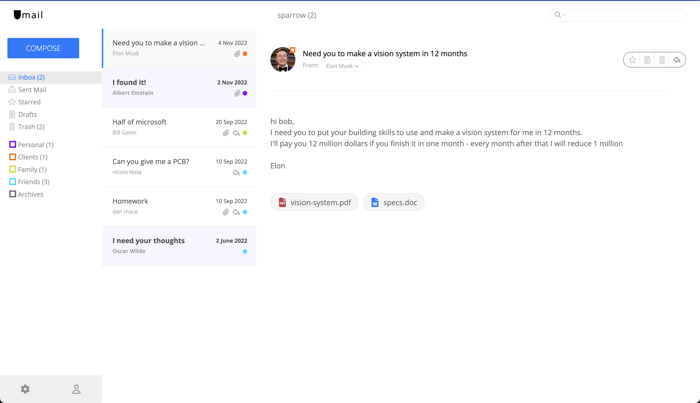

# Umail Web app

A frontend of a mail client

[live link](https://kailashganesh.github.io/Umail/)  



## Tech used
- Html
- Sass
- Javascript
- Webpack
- Webp images
- SVG sprite

## Installation  

clone the repo  
```bash
 git clone https://github.com/KailashGanesh/Umail.git 
```

cd into the folder  
```bash
 cd Umail
```

Install the dependencies  
```bash
 npm install
```

Run server  
```base
npm run dev
```
A browser window should open with [localhost:3000](localhost:3000)